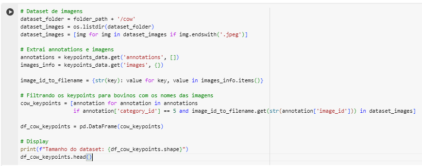

# Ponderada-PoseEstimation

## Etapa 1: Análise Exploratória

### Quantidade de imagens por Classe

Figura 1: Visualização através de gráfico de barras.

A Figura 1 apresenta um gráfico de barras que mostra a quantidade de imagens anotadas para cada classe no dataset. A distribuição das classes indica que o dataset está equilibrado, com 200 imagens em cada classe.

Figura 2: Visualização através de texto.

A Figura 2 fornece a mesma informação de maneira textual, listando a quantidade de imagens para cada classe.

#### Relação da quantidade de imagens bovinas em relação ao dataset inteiro

Figura 3: Gráfico de pizza para visualizar a porcentagem de imagens bovinas.

Na Figura 3, o gráfico de pizza representa a porcentagem de imagens de bovinos em comparação com o restante do dataset. Nota-se que 20% das imagens pertencem à classe de bovinos ('cow'), enquanto 80% estão divididas entre as demais categorias.

### Keypoints

Figura 4: Visualização geral de como é o arquivo keypoints na parte "annotations".

A figura mostra as anotações de keypoints extraídas do arquivo JSON. Cada entrada contém o image_id, o número de keypoints anotados e a categoria à qual a imagem pertence.

Figura 5: Visualização das informações sobre annotations.

Na figura 5 pode-se ver o resumo das categorias anotadas. Há um total de 5 categorias diferentes (dog, cat, sheep, horse, cow), distribuídas entre 4608 imagens.

Figura 6: Gráfico de barras relação de annotations por categoria.

A figura 6 apresenta um gráfico de barras que mostra o número de anotações por categoria, destacando a quantidade de imagens anotadas para cada tipo de animal.

## Etapa 2: Filtrando o Dataset

Figura 7: Código para filtrar apenas os keypoints.

Esse código filtra todos os keypoints das imagens que existem no dataset de bovinos disponível.

Figura 8: Resultado do código da figura 7.

Na Figura 8 podemos notar que o dataset tem 200 linhas, assim como o dataset que tem 200 imagens. Mostrando que todas as imagens disponíveis no dataset de bovinos possuem annotations.

Figura 9: Código e resultado da filtragem do dataframe.

Na Figura 9 o código filtra o dataframe de imagens, que foi utilizado na análise exploratória, criando um novo dataframe apenas com os _paths_ e categorias de imagens de
